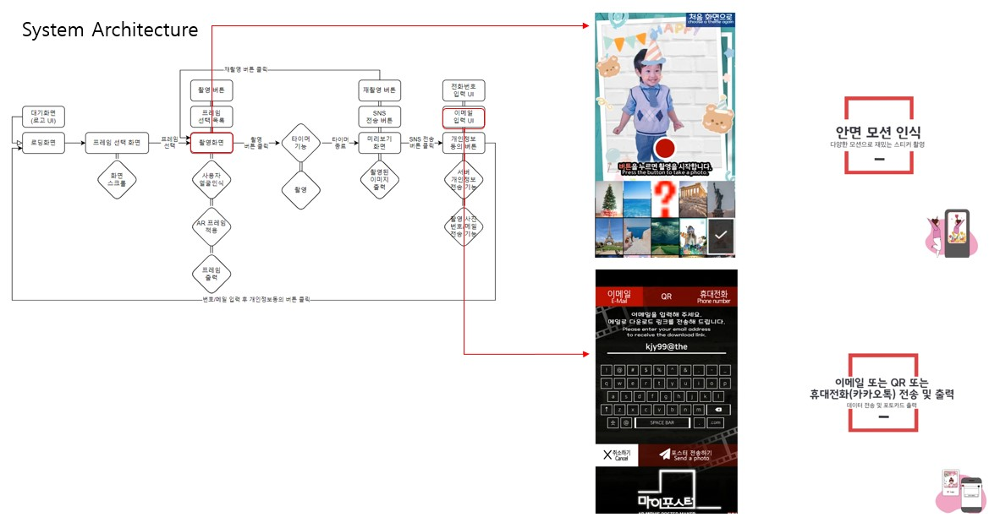

## 💡 Project Overview
### About Project
Development of AR content creation software using Unity, utilizing Google ARCore's **Augmented Faces API**. The software attaches assets (stickers) to a person's face visible in the live camera feed, generating AR content in real-time using Google ARCore.
### Project Objective
A project for the technical development to change the AR engine of the existing AR content creation service, `MyPoster`, from the AR engine of Alchera to Google ARCore. Due to increasing dependency on third-party AR engines and rising license costs, which caused difficulties in service expansion, the project aimed to evaluate the feasibility of applying **Google ARCore's augmented face processing technology** to the `MyPoster` service.

## ⚙️ System Architecture

## 💻 Development Process
---
### Problem Description
The goal of the project was to create an AR kiosk software using **Google ARCore's face recognition** and **ARFoundation** in Unity, where 3D assets (like stickers) can be applied in real-time to a person's face visible through the camera feed. Initially, we faced challenges with properly placing and aligning the 3D objects (such as stickers or masks) on the user’s face due to the limitations of the initial face tracking system.

### Chllenges Encountered:  
1. **Face Tracking Precision**:  
   Initially, face tracking wasn't accurate enough to properly align the 3D assets with the user's face in real-time, especially when considering the dynamic nature of facial expressions and movements (e.g., turning the head, smiling).
2. **Handling Multiple Regions**:
   We needed to track specific regions of the face (e.g., forehead, nose, eyes) to place the assets precisely. The challenge was how to manage the regions and update the positions of the 3D objects based on real-time face tracking data.

---
### **Solution Approach**
---
To overcome the challenges, we used **Google ARCore's Augmented Faces API** integrated into **ARFoundation** to enhance our face tracking accuracy and apply assets to the face dynamically.
- **Utilizing ARFaceManager**:
   We used the `ARFaceManager` to track and manage the face-related data provided by ARCore. This allowed us to access the **regions of the face**, such as **forehead**, **eyes**, **nose**, and other facial landmarks, which were essential for precise placement of 3D objects.
- **Dynamic Object Placement**:
   In the `Update()` function, the code checks if the tracked regions match certain facial areas like the **right forehead** and **left forehead**, and then instantiates the respective 3D objects (`rightPrefab` and `leftPrefab`). The objects are aligned with the corresponding facial region in real-time, adjusting their position and rotation dynamically based on the face’s movements.
- **Material Swapping**:
   To provide users with an interactive experience, we added a functionality to switch **facial materials** (like changing stickers) in the `SwitchFace()` function. Each time the button is pressed, the material of the face changes in a loop, allowing users to try different stickers on their faces.
- **3D Object Instantiation and Positioning**:
   We placed the 3D assets (stickers or masks) on the user’s face based on the data from ARCore’s **face mesh**. By adjusting the `localPosition` and `localRotation` of the instantiated objects, we ensured that the assets stayed on the user's face as they moved.

---
### **Process and Steps Taken**
---
1. **Initial Setup**:  
   We set up the **ARSessionOrigin** and **ARFaceManager** to start tracking the face with **ARCore**. The `ARFaceManager` provided the necessary tracking of the face and access to the **face region data**.
2. **Face Region Tracking**:  
   We leveraged the **ARCoreFaceRegionData** to track the specific regions of the face. In the code, we focused on tracking the **ForeheadLeft** and **ForeheadRight** regions to place objects like stickers (right and left forehead).
3. **Object Instantiation**:  
   The objects (stickers) were instantiated dynamically when a tracked face region was found, and their positions were continuously updated to follow the facial movements. This helped to keep the stickers stable on the user’s face, even during movement.
4. **Material Switching**:  
   A button press triggered the **material swap** functionality. The `SwitchFace()` method was implemented to cycle through different **face materials** in a loop, giving users the ability to customize their look with various stickers or textures.
5. **Future Updates and Improvements**:  
   Further improvements could include adding more dynamic regions for sticker placement (e.g., eyes, nose) and enhancing **object interaction** to allow users to rotate or scale stickers in real-time.

---
### **Conclusion**
---
By integrating **Google ARCore** and **ARFoundation**, we successfully built an **AR Kiosk software** that can **track faces** and apply **3D assets** like stickers to the face in real-time. The project demonstrated how **dynamic object tracking** and **material switching** can provide an engaging AR experience for users.  
With further refinements in **tracking accuracy** and **interaction features**, the project can be expanded to provide even more interactive AR experiences in the future.

## 🎥 MyPoster Promotional Video

## 📥 Final Deliverable
You can download the final deliverable from the following link: [Download Final Deliverable](https://drive.google.com/drive/folders/1qNKhm8pmeKSLuWWxubLuLbLdED3sYqO7)
